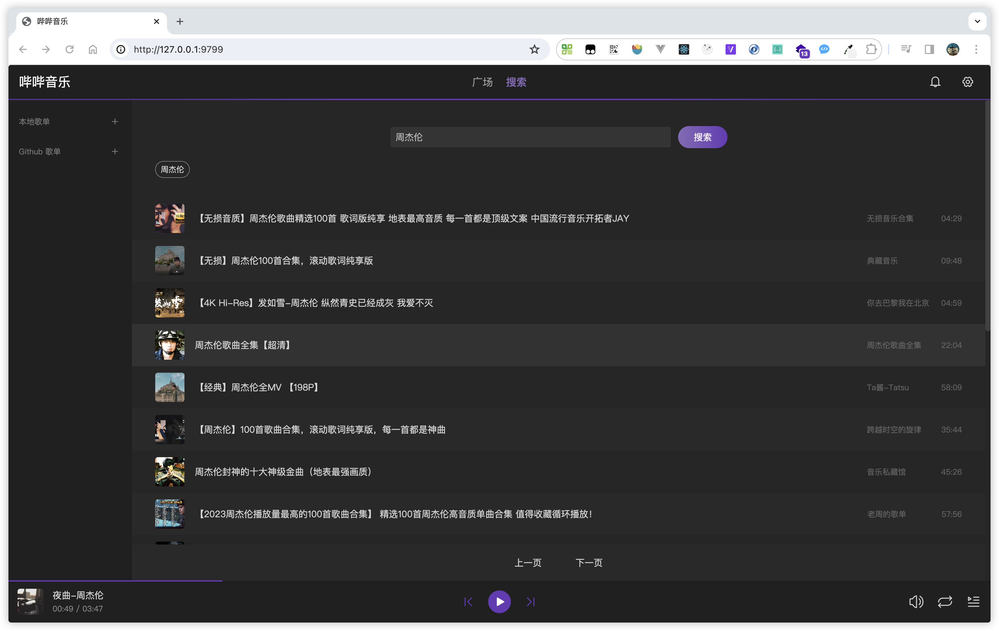

# 哔哔音乐服务端

将哔哔音乐运行在服务器中，提供 API 接口，自由调用。也可以通过浏览器访问使用


## 拉取前端资源

```bash
go run cmd/pullfe.go --token={githubtoken}
```

或手动下载解压 dist.tar.gz 文件, 保证 dist 目录结构

https://github.com/bb-music/web/releases

```
cmd
dist
  - index.html
  - index.css
  - index.js
doc
internal
```

## 启动运行

```bash
go run ./main.go
```

## 启动参数

表格
| 参数 | 说明 | 默认值 |
| ---- | ---- | ---- |
| -p | 端口 | 9799 |
| -dev | 以开发模式启动 | false |
